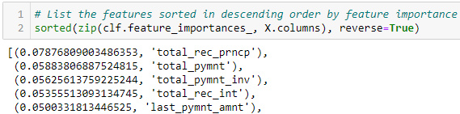

# Overview of the analysis 
The purpose of this analysis was to prepare data, employ statistical reasoning, and use machine learning to train and evaluate models and classify loans. This informed predictions on credit risk. 

I used oversampling, undersampling, combination sampling (SMOTEENN), Balanced Random Forest, and Easy Ensemble Classification to predict credit risk.  

# Results
The following images depict the balanced accuracy scores and the precision and recall scores of 
six machine learning models.

* This model proved very precise in predicting low-risk loans, but not very precise with high-risk loans. However, the balanced accuracy (geo) and f1 scores for both are relatively similar, and indicate this may not be the best model for predicting credit risk.

* SMOTE Oversampling produced similar results to Random Oversampling, but with slightly higher balanced accuracy and f1 scores.

* Clustered Centroid Undersampling returned similar precision to the oversampling models, but with significantly lower balanced accuracy and f1 scores. This is a common potential issue with using smaller sample sizes in model prediction.

* This model produced similar results to both of the oversampling and undersampling models. 

* The Balanced Random Forest Model produced the highest balanced accuracy and f1 scores until the following model was run.

* This model yielded the most accuracy and precision across all metrics produced for both high-risk and low-risk loans. 

# Summary
The progressive improvement in precision and accuracy across the models used validates the models as adequate predictors of **low-risk** credit loans. The main concern remains predicting high-risk loans. Interestingly (or per accepted norms?) the most important features when predicting credit risk are rather definitive *PAST* factors: total principle recieved and total payments, as noted in the following image:

Overall, I would not recommend even the most precise and accurate model (Easy Ensemble Adaboost) because of it's relative inability to predict high-risk credit issues. I do not feel those percentages would be acceptable to organizations where turning a profit depends on timely loan repayment.

As credit becomes more and more scarce or out of reach for Americans, perhaps a model that takes in to consideration more intangible factors, might provide more inclusive pathways for people seeking credit and lenders to be more comfortable with each other.

